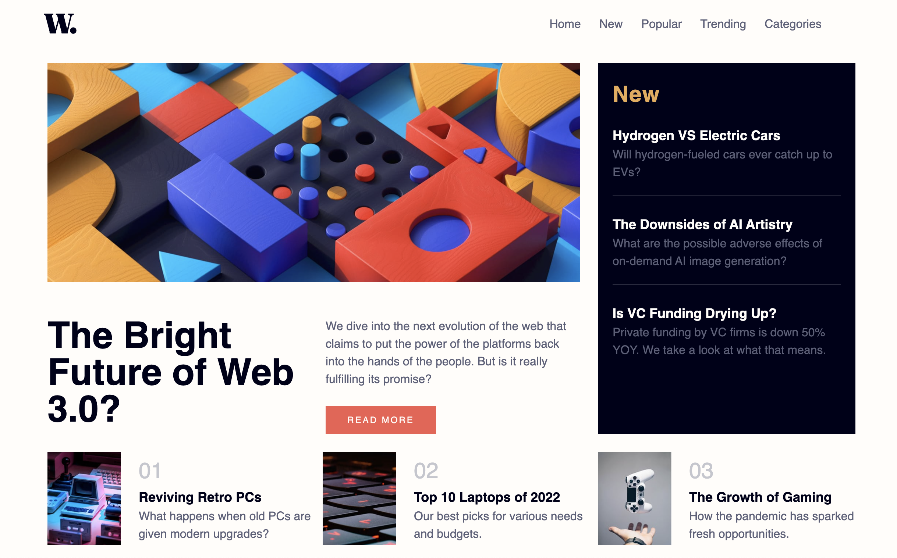
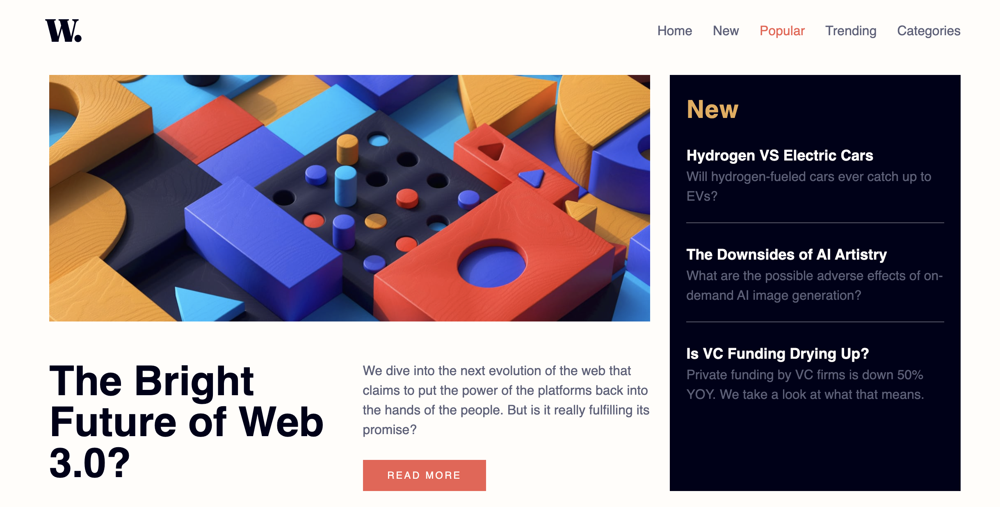
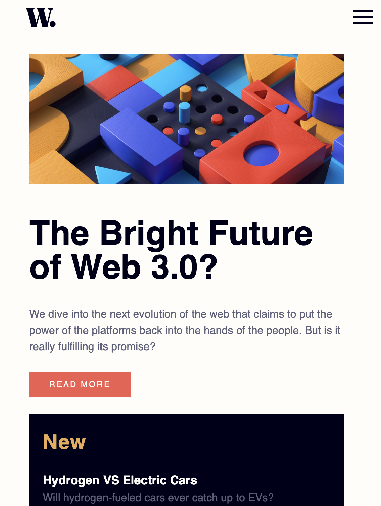
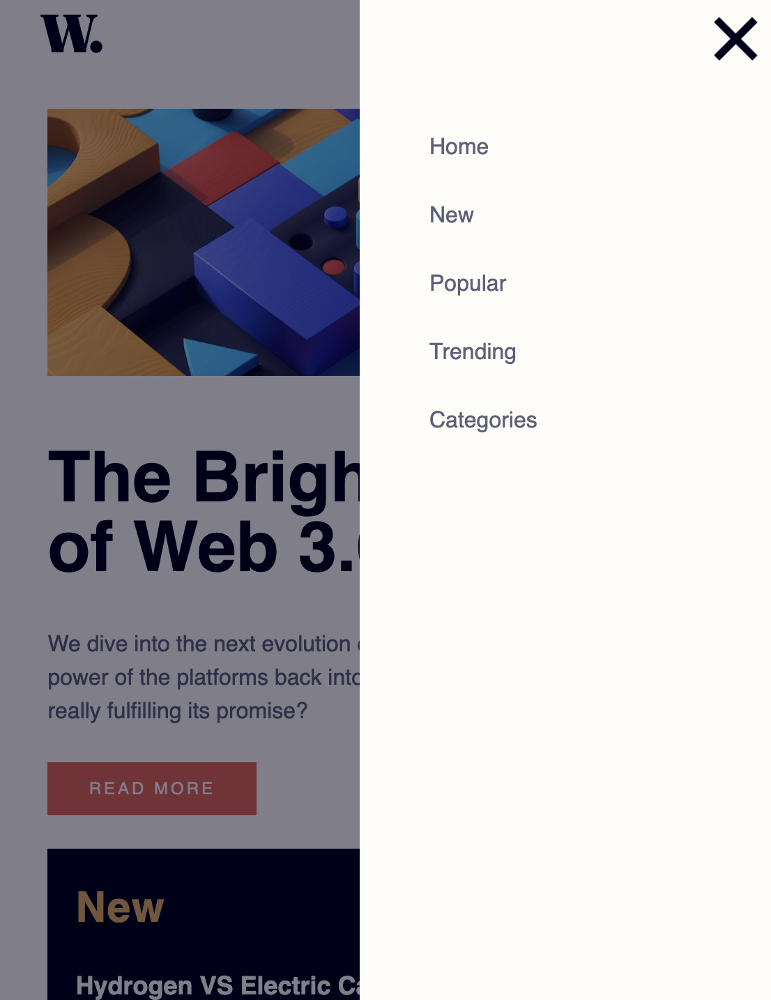

# Frontend Mentor - News homepage solution

This is a solution to the [News homepage challenge on Frontend Mentor](https://www.frontendmentor.io/challenges/news-homepage-H6SWTa1MFl). Frontend Mentor challenges help you improve your coding skills by building realistic projects. 

## Table of contents

- [Overview](#overview)
  - [The challenge](#the-challenge)
  - [Screenshot](#screenshot)
  - [Links](#links)
- [My process](#my-process)
  - [Built with](#built-with)
  - [What I learned](#what-i-learned)
  - [Continued development](#continued-development)
- [Author](#author)
- [Acknowledgments](#acknowledgments)

**Note: Delete this note and update the table of contents based on what sections you keep.**

## Overview

### The challenge

Users should be able to:

- View the optimal layout for the interface depending on their device's screen size
- See hover and focus states for all interactive elements on the page

### Screenshot

Here's the desktop view

Here's an example of the desktop menu active state 

Here's what mobile looks like

And here's my mobile menu

### Links

- Solution URL: 
- Live Site URL: 

## My process

### Built with

- Semantic HTML5 markup
- CSS custom properties
- Javascript
- CSS Grid
- Mobile-first workflow

### What I learned

Oh man, where to start. 

1. How to build mobile first using media queries

2. How to get CSS Grid to work and be responsive, even if it meant rewriting everything. S/O to Kevin Powell on Youtube  and this article saved my life 

3. Kevin Powell also showed me how to initialize variables in CSS for efficiency when working from a given design

4. How to create a mobile hamburger menu from scratch. S/O Web Sev Simplified on Youtube 

5. How to dim the background when you click the mobile menu 

6. How to make my own icons through the use of empty spans (hamburger menu) and skewX/skewY on letters or symbols (+ used for X on menu)

7. How to manage visibility through the use of z-index. I pieced this together from the dimmer article and random Stack Overflow posts

8. How to make margin and padding responsive through the use of % instead of px. This one hit hard. 

### Continued development

Through this process, I realized how much you can do with just CSS. I want to continue to build sites mobile first with media queries for responsiveness. I want to keep building with CSS Grid. And I want to continue building custom widgets for my sites and continue to never copy/paste into my code. Even if it's hard, it teaches me something. 

## Author

- Frontend Mentor - [@importvince](https://www.frontendmentor.io/profile/importvince)

## Acknowledgments

Thank you to all the creators, bloggers, and random stack overflow commenters who helped make this a reality. And thank you to my girlfriend for being understanding when I code while we watch Netlfix.
